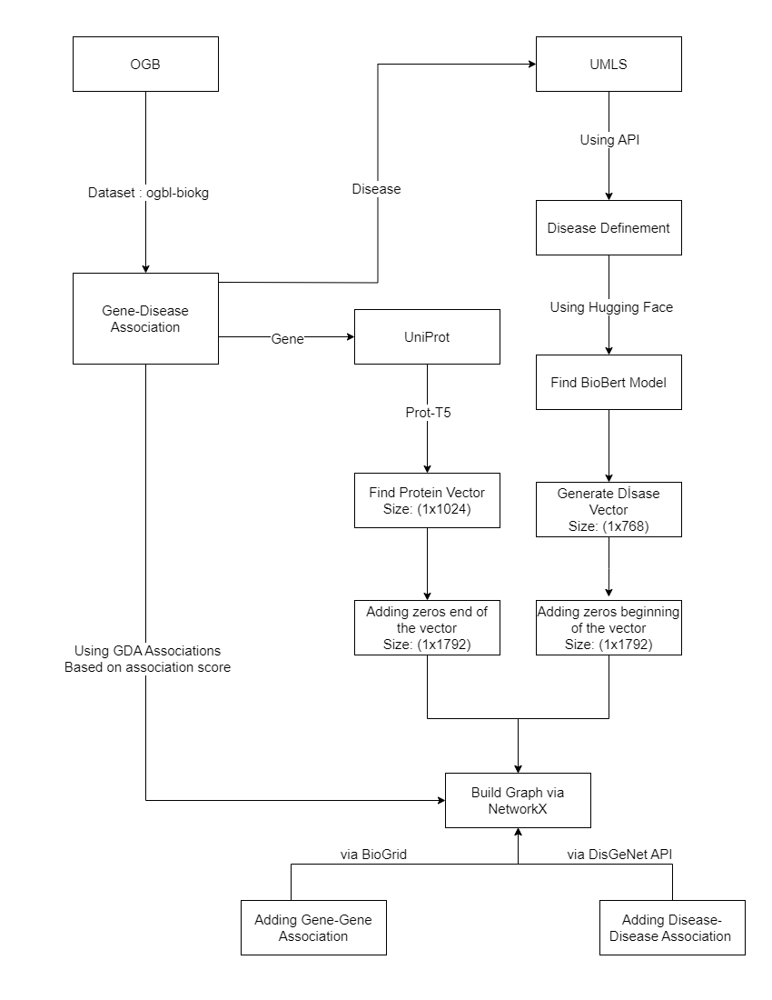

# Build-Graph: Graph Construction

## Overview
This component builds graph files based on the OGB ***ogbl-biokg*** dataset, enhanced with additional sources.

### Key Features:
- Uses OGB ***ogbl-biokg*** dataset (standardized benchmark)
- Incorporates BioGrid and UniProt for additional information
- Creates graph files optimized for comparison with other methods

### Visualization
<p align="center">
    
</p>

***Figure 1***: Visualization of the graph construction process showing how gene-disease associations are built from OGB ***ogbl-biokg*** dataset.

## Usage
For example, you want build a graph based on OGB's ***ogbl-biokg*** dataset, you can run this command.

```
    python3 build_graph_ogb_comparison.py
```

## Important Notes
- ***python*** keyword is used to call ***python3*** in some machines. If your machine is like that, you can change ***python3*** keyword with ***python*** keyword.

