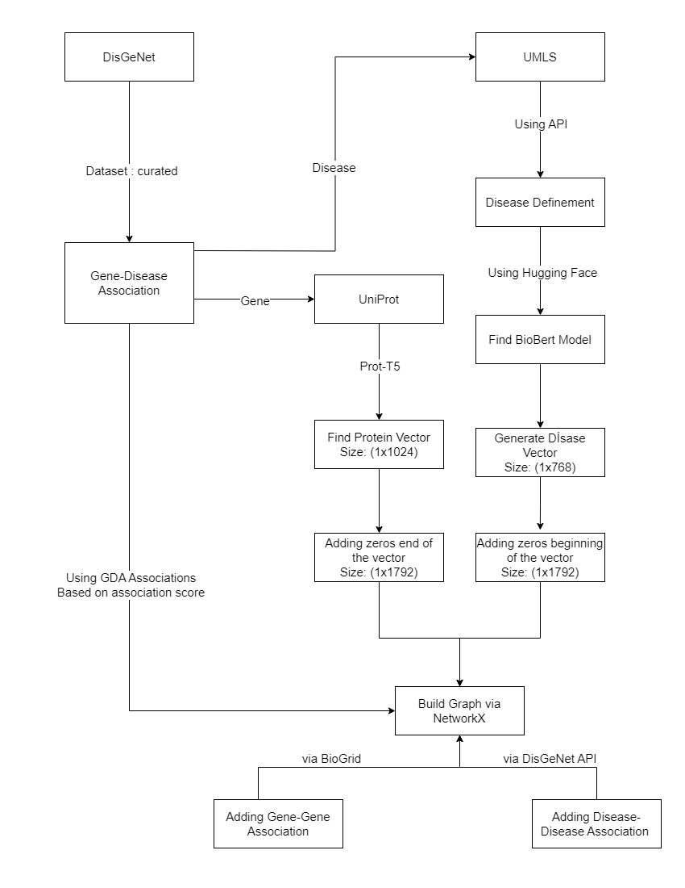

# Build-Graph: Graph Construction

## Overview
This component builds graph files based on the DisGeNET curated dataset, enhanced with additional sources.

### Key Features:
- Uses DisGeNET curated dataset (same as SkipGNN)
- Incorporates BioGrid and UniProt for additional information
- Creates graph files optimized for comparison

### Visualization
<p align="center">
    
</p>

***Figure 1***: Visualization of the graph construction process showing how gene-disease associations are built from DisGeNET curated dataset.
## Usage
For example, you want build a graph based on DisGeNET curated dataset, you can run this command.

```
    python3 build_graph_skipgnn_comparison.py
```

## Important Notes
- ***python*** keyword is used to call ***python3*** in some machines. If your machine is like that, you can change ***python3*** keyword with ***python*** keyword.
