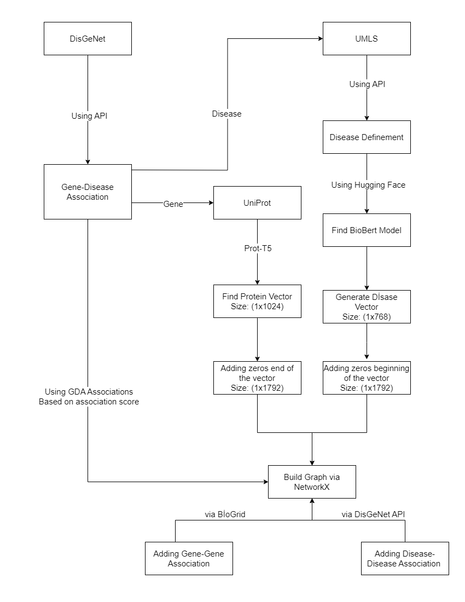

# Build-Graph

In this part, customizable graph files are built. Steps' of the build customizable graph is mentioned in below. 

:warning:

<p align="center"> 
    
</p>


## Input Parameter

Only input parameter is gene-disease score. 

### Example Usages
For example, you want build a graph that gene-disease score is equal and more that 0.5, you can run this command.

```
    python3 build_graph.py 0.5
```

---

Another example, you want build a graph that gene-disease score is equal and more that 0.1, you can run this command.

```
    python3 build_graph.py 0.1
```

---

Another example, you want build a graph that gene-disease score is equal and more that 0.05, you can run this command.

```
    python3 build_graph.py 0.05
```


:warning:

***python*** keyword is used to call ***python3*** in some machines. If your machine is like that, you can change ***python3*** keyword with ***python*** keyword.