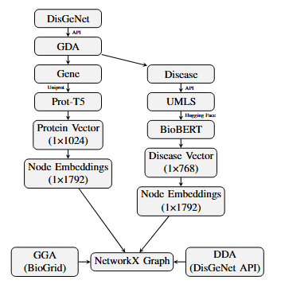
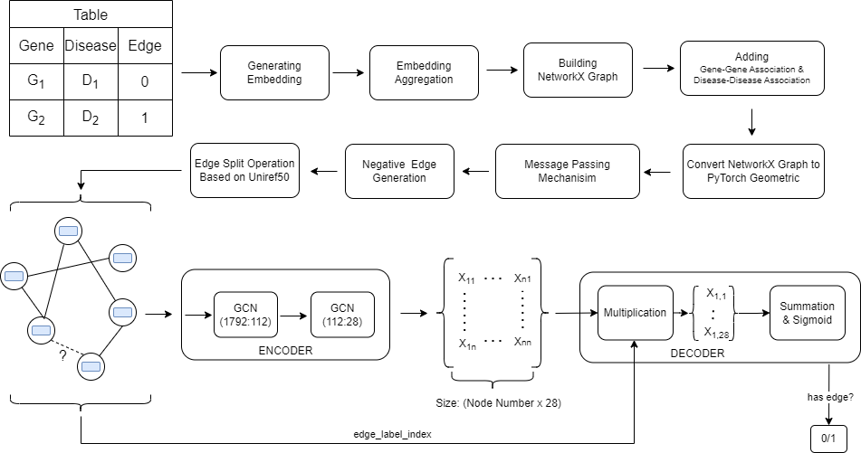

# GLADIGATOR: Graph Learning-bAsed DIsease Gene AssociaTiOn pRediction

GLADIGATOR: (Graph Learning-bAsed DIsease Gene AssociaTiOn pRediction) is a machine learning model that is used to predict gene-disease association.Model use protein seqeunce and disease definement. Protein sequence is vectorized by [ProtT5 Model](https://www.uniprot.org/help/downloads#embeddings:~:text=protein%20per%2Dresidue-,Homo%20sapiens,-per%2Dprotein%20per) that generated vectors saved in a file (per-protein.h5). Disase definement is vectorized by [BioBert v1.1 Model](https://huggingface.co/dmis-lab/biobert-v1.1) vectorization operation that was created by [DMIS-Lab](https://dmis.korea.ac.kr). In this project, dataset was gathered from [Disgenet (v7.0)](https://www.disgenet.org/dbinfo#:~:text=Version%20History-,May%204%2C%202020,-DisGeNET%20Database%207.0). In Disgenet(v7.0), contains 1,134,942 gene-disease associations (GDAs), between 21,671 genes and 30,170 diseases, disorders, traits, and clinical or abnormal human phenotypes.
In addition, gene-gene associations and disease-disease associations are added. Gene-gene associations were downloaded from [BioGrid v4.4.217](https://downloads.thebiogrid.org/File/BioGRID/Release-Archive/BIOGRID-4.4.217/BIOGRID-ORGANISM-4.4.217.tab.zip). In this project, only homo-sapiens' genes were used. Disease-disesae associations were gathered from DisGeNet via [API](https://www.disgenet.org/api/#/DDA:~:text=org/dbinfo%23section45-,Disease%2DDisease%20Associations%20(DDAs),-The%20DDAs%20service). In this model, train/validation/test split is splited based on [Uniref50](https://www.uniprot.org/help/uniref#:~:text=e.g.%C2%A0%22UniRef90_P99999%22.-,UniRef50,-UniRef50%20is%20generated)


&nbsp;

## Development and Dependencies

### This project can be run every operating system. However, ***Ubuntu 22.04.3*** is recommanded.
- Python 3
- Pip3
- Clone repository
- Install dependencies

    - all test run on CPU, if you want to run other devices, you should change some packages.
    - in Ubuntu (Recommended) or MacOS, 
    ```
        pip3 install -r requirementsUbuntu.txt
    ```
    - in Windows,
    ```
        pip3 install -r requirements.txt
    ```
    
    

&nbsp;

## Descriptions of folders and files in the GALDIGATOR repository 

:warning: :warning:


GLADIGATOR projects contains 4 main parts. These parts are explained in below.

    
    1. Main-Project: 
    In this part, proposed method explained detailly. We use DisGeNet API Data Source with GDA Score limitations. Also, we use BioGrid datas. 

    2. Comparison-SkipGNN: 
    In this part, proposed method explained detailly. We give brief information about method comparison between GLADIGATOR and other methods that are used DisGeNet Curated dataset. Also, we use BioGrid datas.

    3. Comparison-Open-Graph-Dataset: 
    In this part, proposed method explained detailly. We give brief information about method comparison between GLADIGATOR and other methods that are used OGB(ogbl-biokg) dataset. Also, we use BioGrid datas. 

    4. Trained-Models: 
    In this part, trained models of the proposed methods are saved. If somebody want to make association prediction between genes and diseases, they can run MakePrediction.py script.  

There is a readme file inside of the every project folder.

&nbsp;

## GALDIGATOR Usage

This section intends to guide the users on how to run GALDIGATOR. 

:warning: :warning: :warning: 

First of all, please read readme files inside **source-files** and **graph-files** folders. File **UNZIP** operations are required. File **UNZIP** operations' command is written in readme files in **source-files** and **graph-files** folders.

# Proposed Project Steps:

The proposed method is mentioned in below. Also inside of the Main-Project folder, proposed method's steps are mentioned with seperated folder.


## **Gathering-Data**
------------------------
This part is used to gather information from UMLS and DisGeNet via using API. 


:warning:

Before run this programs, you must build config.py file that store required information when access UMLS and DisGeNet API.

Apikey is required to access [UMLS](https://uts-ws.nlm.nih.gov/rest/content/) server. Apikey is used to gather data from [UMLS](https://uts-ws.nlm.nih.gov/rest/content/) server, you can research in this [documentation](https://documentation.uts.nlm.nih.gov/rest/search/)

Email and password is used to enroll to the Disgenet, you can research in this [documentation](https://www.disgenet.org/api/). 

:warning:

DisGeNet API is not available at this moment. Please use source files in source-files folder. 


:warning:

Your config.py file must be inside of the ./Main-Project/Gathering-Data/ folder.

:warning:

Inside of the config.py file is mention in below

	config = {
		"email":"example@example.com",
		"password":"example",
		"apikey":"example-apikey"
	}


:warning:


if you want to gather DisGeNet informations, you should this command that mentioned in below.
```
	python3 gather_gene_disease_information.py
```

---


if you want to gather diseases informations from UMLS, you should this command that mentioned in below.

```
	python3 gather_disease_data_from_umls.py
```


:warning:

***python*** keyword is used to call ***python3*** in some machines. If your machine is like that, you can change ***python3*** keyword with ***python*** keyword.

## **Build-Graph**
------------------------

In this part, customizable graph files are built. Steps' of the build customizable graph is mentioned in below. 

:warning:

<p align="center"> 
    
</p>


### Input Parameter

Only input parameter is gene-disease score. 

#### Example Usages
For example, you want build a graph that gene-disease score is equal and more that 0.5, you can run this command.

```
    python3 build_graph.py 0.5
```

---

Another example, you want build a graph that gene-disease score is equal and more that 0.1, you can run this command.

```
    python3 build_graph.py 0.1
```

---

Another example, you want build a graph that gene-disease score is equal and more that 0.05, you can run this command.

```
    python3 build_graph.py 0.05
```


:warning:

***python*** keyword is used to call ***python3*** in some machines. If your machine is like that, you can change ***python3*** keyword with ***python*** keyword.


## **Run-Model**
------------------------

In this part, our deep learning model is trained and tested. Steps' of the train/test process and the model architecture are mentioned in below.

<p align="center"> 
    
</p>


### Input Parameter
Only input parameter is a path of the graph file that is a dataset model is trained/tested on this dataset.

#### Example Usages
For example, you want run model with min gene-disase score is 0.5, you can call this command.
```
    python3 run_model.py "../../graph-files/Graph_Own_0.5.pt"
```

Another example, you want run model with min gene-disase score is 0.1, you can call this command.

```
    python3 run_model.py "../../graph-files/Graph_Own_0.1.pt"
```

Another example, you want run model with min gene-disase score is 0.1, you can call this command.

```
    python3 run_model.py "../../graph-files/Graph_Own_0.05.pt"
```


:warning:

***python*** keyword is used to call ***python3*** in some machines. If your machine is like that, you can change ***python3*** keyword with ***python*** keyword.

## Output Files

After train model operation is completed. Best validation and test result is stored in a csv file.

---

For example, you run this command, that is mentioned in below.
```
    python3 run_model.py "../../graph-files/Graph_Own_0.5.pt"
```

End of the train process, the best validation and test result are store in ***val-resultsGraph_Own_0.5.csv*** and ***test-resultsGraph_Own_0.5.csv***

---

Another example, you run this command, that is mentioned in below.

```
    python3 run_model.py "../../graph-files/Graph_Own_0.1.pt"
```

End of the train process, the best validation and test result are store in ***val-resultsGraph_Own_0.1.csv*** and ***test-resultsGraph_Own_0.1.csv***

---

Another example, you run this command, that is mentioned in below.

```
    python3 run_model.py "../../graph-files/Graph_Own_0.05.pt"
```

End of the train process, the best validation and test result are store in ***val-resultsGraph_Own_0.05.csv*** and ***test-resultsGraph_Own_0.05.csv***


## Make Prediction With Trained Models 

For example, you want to make prediction between gene PRPH2 and disease C0016529 via using Graph_Own_0.5_model.pth trained model. You should call this command
```
    python3 MakePrediction.py Graph_Own_0.5_model.pth PRPH2 C0016529
```

For example, you want to make prediction between gene AGER and disease C1518922 via using Graph_Own_0.05_model.pth trained model. You should call this command

```
    python3 MakePrediction.py Graph_Own_0.05_model.pth AGER C1518922
```

:warning:

Your config.py file must be inside of the ./trained-models.

:warning:

Inside of the config.py file is mention in below

	config = {
		"email":"example@example.com",
		"password":"example",
		"apikey":"example-apikey"
	}


:warning:


&nbsp;

## License
Copyright (C) 2023 HUBioDataLab

This program is free software: you can redistribute it and/or modify it under the terms of the GNU General Public License as published by the Free Software Foundation, either version 3 of the License, or (at your option) any later version.

This program is distributed in the hope that it will be useful, but WITHOUT ANY WARRANTY; without even the implied warranty of MERCHANTABILITY or FITNESS FOR A PARTICULAR PURPOSE. See the GNU General Public License for more details.